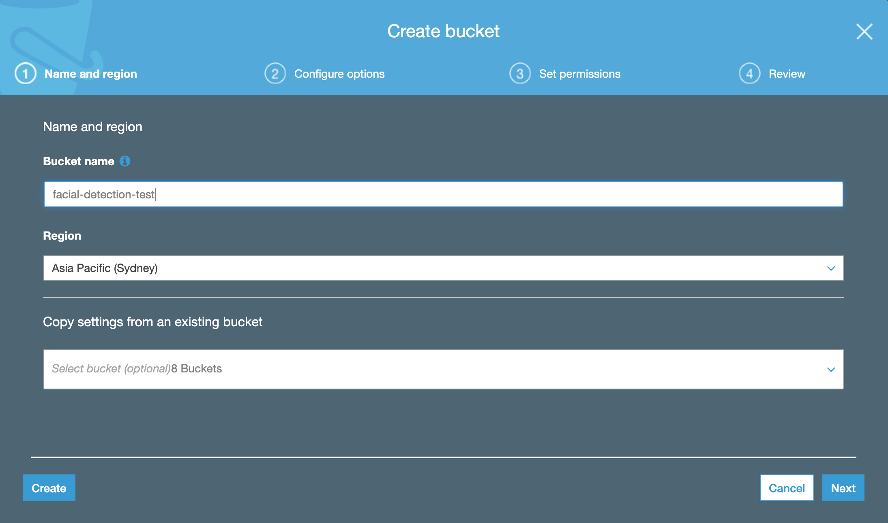

# Facial Rekognition Workshop

> If you’ve built an application using AWS in the past or understand key cloud concepts, this workshop is suited for you. You will use AWS Rekognition to build an online gallery of ML detections, and use AWS services to scan, detect and draw data science inferences from the scans.


***ML APP DEMO***


## Table of Contents

- [Setting up your Development Environment](#setting-up-your-development-environment)
  - [Provisioning your Cloud 9 IDE](#provisioning-your-cloud-9-ide)
  - [Setting up your Cloud 9 w/ React application](#setting-up-your-cloud-9-w/-react-application)
<br />

---

## Setting up your Development Environment
<br />

### Provisioning your Cloud 9 IDE

1. Goto your AWS console via this link: https://aws.amazon.com/

2. Search up 'Cloud 9' in the search bar, and click on the first option.

3. Click 'Create Environment'

4. Set the **name** of your environment to be 'MLWorkshop'.\
   Click 'Next Step'.\
   Under 'Instance Type' select 'Other instance type', and search for 't3.medium' in the dropdown search.

5. Leave everything else as default.\
   Click 'Next Step'.\
   Click 'Create Environment'.

### Setting up your Cloud 9 w/ React application

From the cloud9 service in aws, there should now be a c9 provisioned. Clicking on the **Open IDE** button should then open your c9; might take a bit if you haven't used it in a while.
<br />

1. Clone the current repository to your Cloud9 IDE.
   
   ```shell
   git clone https://github.com/oconpa/facial_rekog_tute.git
   ```

2. Install yarn
   ```shell
   npm install -g yarn
   ```

3. Move into the cloned directory, and install all required packages. 

   ```shell
   cd frontend
   yarn
   ```

5. Run the React application
   ```shell
   yarn start
   ```
   
6. Preview your Web Application
   
   After the app has compiled successfully, click 'Tools' in the toolbar up top, click 'Preview' and finally click 'Preview Running Application'. 
   Open the preview in another tab by clicking the arrow / box button on the right of the search bar. 
   


**You should see a basic web app in your browser! However, there is currently no functionality. Let's use AWS to fix this!**

---

## Step 1: Provision both an s3 and lambda resource

Create a new bucket with whatever name you desire. We will assume throughout this tutorial that you name your bucket -> facial-detection-<Your Full Name>
  


And then provision a lambda.


## Step 2: Expose Upload Route

Next we will setup our lambda with the correct imports and variables to be used later. Copy the following code and edit the bucket name to match the bucket you created above.

```python
import boto3
import json
from botocore.exceptions import ClientError

client = boto3.client('rekognition')
s3 = boto3.client('s3')
bucket_name = "facial-detection-<Your Full Name>"
expiration = 120
```

Uploading involves creating a route and exposing it on lambda to serve the purpose of saving along with it's Machine Learning detection results to the s3. To do this we must first provide the relevant code on the lambda. Copy the following code and add it to your lambda.

```python
def handler(event, context):
    if (event['path'] == '/upload'):
        try:
            response = s3.generate_presigned_url(
                        'put_object',
                        Params={
                            'Bucket': bucket_name,
                            'Key': event['queryStringParameters']['fileName'],
                            'ContentType': 'multipart/form-data'
                        },
                        ExpiresIn=expiration)
        except ClientError as e:
            logging.error(e)
            return None

        return {
            'statusCode': 200,
            'headers': {
                "access-control-allow-origin": "*"
            },
            'body': json.dumps(response)
        }
```

#### Exposing the route via API Gateway

With relevant upload route now added to your lambda it's time to expose this the route on API Gateway. To do this we need to:
- Create a new public REST API from the API service.

- Create a resource named upload, and attach a GET method to it.


- Point your API to the lambda.

- Deploy and copy the upload link.


---

## Step 3: Connecting the React Frontend to the Upload Route Backend

After deploying the API and copying the link, it can now be consumed and used in the frontend.


it's can be used in our app. Navigate to the deployed section of API Gateway copying the link to be used in your app.


