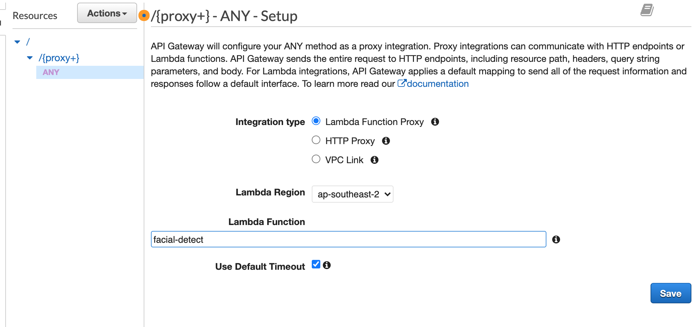

# Facial Rekognition Workshop

> If you’ve built an application using AWS in the past or understand key cloud concepts, this workshop is suited for you. You will use AWS Rekognition to build an online gallery of ML detections, and use AWS services to scan, detect and draw data science inferences from the scans.


***ML APP DEMO***


***App Link (Demo)***

http://facial-hosting.s3-website-ap-southeast-2.amazonaws.com/

## Table of Contents

- [Definitions](#definitions)
- [Overview](#overview)
- [Setting up your Development Environment](#setting-up-your-development-environment)
  - [Provisioning your Cloud 9 IDE](#provisioning-your-cloud-9-ide)
  - [Setting up your Cloud 9 with React application](#setting-up-your-cloud-9-with-react-application)
- [Create an S3 with CORS](#create-an-s3-with-cors)
- [Create the lambda (backend)](#create-the-lambda-(backend))
- [Create and Expose API Gateway](#create-and-expose-api-gateway)
- [Connecting the React Frontend to the Upload Route Backend](#connecting-the-react-frontend-to-the-upload-route-backend)
- [Detection Time](#detection-time)
  - [Connect detect to React Frontend](#connect-detect-to-react-frontend)
  - [Connect listgallery to React Frontend](#connect-listgallery-to-react-frontend)
  - [Connect delete to React Frontend](#connect-delete-to-react-frontend)
  - [Connect charts to React Frontend](#connect-charts-to-react-frontend)

<br />

## Definitions
|Term|Description|
|----|-----------|
|AWS| Amazon Web Services|
|S3| Simple Storage Solution, object storage service, also can be used to host static websites|
|Cloud 9| An IDE that runs in a browser inside your AWS account|
|Lambda| AWS's servlerss option, upload code that runs without users needed to provision servers|
|Rekognition| ML service interface in AWS|
|API Gateway| A proxy to aws services that enables an authentigation check point|
|ML| Machine Learning|

## Overview

With a rising potential on what machine learning has to offer, AWS offers an easy plug-n-play module to integrate machine learning services very easily. AWS Rekognition is AWS's inbuilt ML service.

## Setting up your Development Environment

Cloud 9 is AWS's cloud IDE making developing on the cloud much easier. Forget about access keys and secrets, with a cloud 9 environment you can develop from within the VPC.

### Provisioning your Cloud 9 IDE

1. Goto your AWS console via this link: https://aws.amazon.com/

2. Search up **Cloud 9** in the search bar, and click on the first option.

3. Click **Create Environment**

4. Set the **name** of your environment to be **MLWorkshop**.\
   Click **Next Step**.\
   Under **Instance Type** select **Other instance type**, and search for **t3.small** in the dropdown search.

5. Leave everything else as default.\
   Click **Next Step**.\
   Click **Create Environment**.

### Setting up your Cloud 9 with React application

1. Clone the current repository to your Cloud9 IDE.
   
   ```git
   git clone https://github.com/oconpa/facial_rekog_tute.git
   ```

2. Move into the cloned directory, and install all required packages. 

   ```shell
   cd facial_rekog_tute/frontend
   npm install
   ```

3. Run the React application
   ```npm
   npm run start
   ```
   
4. Preview your Web Application
   
   After the app has compiled successfully, click **Tools** in the toolbar up top, click **Preview** and finally click **Preview Running Application**. 
   Open the preview in another tab by clicking the arrow / box button on the right of the search bar.


   
**You should see a basic web app in your browser! However, there is currently no functionality. Let's use AWS to fix this!**

---

## Create an S3 with CORS

1. From the aws console, search up **S3** in the search bar, and click on the first option. If you can't find it click [here](https://s3.console.aws.amazon.com/s3/home?region=ap-southeast-2#)

2. Select **Create Bucket** on the s3 console.

3. Name your bucket <pre>facial-detection-<b>Replace with your full name</b></pre>


<i>Make sure you replace with your full name where indicated above, leave the rest of the options as default.</i>

4. Click **Create** ( to the lower left, don't click next )


5. Click on the bucket you just created, clicking on the **Permission** tab from within the bucket. You should then see four sub options, go to **CORS configuration** and paste the following code:

```html
<?xml version="1.0" encoding="UTF-8"?>
<CORSConfiguration xmlns="http://s3.amazonaws.com/doc/2006-03-01/">
<CORSRule>
    <AllowedOrigin>*</AllowedOrigin>
    <AllowedMethod>PUT</AllowedMethod>
    <AllowedHeader>*</AllowedHeader>
</CORSRule>
</CORSConfiguration>
```

5. Click **Save**


## Create the lambda (backend)

1. From the aws console, search up **Lambda** in the search bar, and click on the first option. If you can't find it click [here](https://ap-southeast-2.console.aws.amazon.com/lambda/home?region=ap-southeast-2#/functions)

2. Click **Create function**

3. On the create function page:

<pre>
- Name your function <b>facial-detect</b>
- Set your runtime to <b>Python 3.8</b>
</pre>

4. Click **Create function**


5. Once created and inside the lambda, click into the **Permissions** tab (located at the top of the lambda). Under **Execution role** (the first section under the new tab) will be a role name, Click it.

6. In the newly opened window click on the blue button **Attach policies**. Using the search bar, search for the following policies, checking the boxes once you've found them.

```
- AmazonS3FullAccess
- AmazonRekognitionFullAccess
```

7. Once both policies have been checked, click **Attach policy**

8. After attaching the policy go back to your lambda (it should already be open in your browser on another tab) and under the **Configuration** tab in the **function code** section (scroll down on the lambda until you see a suitable place to paste code), paste:

```python
import boto3
import json

rekognition = boto3.client('rekognition')
s3 = boto3.client('s3')
bucket_name = "facial-detection-REPLACEME"
expiration = 120

def lambda_handler(event, context):
    print(event)
    path = event['path'].split("/")[1]
    body = ''
    if (path == 'upload'):
        body = doUpload(event)
    elif (path == 'detect'):
        body = doFacialDetection(event)
    elif (path == 'delete'):
        body = doDelete(event)
    elif (path == 'listgallery'):
        body = doListGallery(event)
    elif (path == 'charts'):
        body = doChart(event)
    
    return {
            'statusCode': 200,
            'headers': {
                "access-control-allow-origin": "*",
                "access-control-allow-methods": "*"
            },
            'body': body
    }
    

# Upload method
def doUpload(event):
    response = s3.generate_presigned_url(
        'put_object',
        Params={
            'Bucket': bucket_name,
            'Key': event['queryStringParameters']['fileName'],
            'ContentType': 'multipart/form-data'
        },
        ExpiresIn=expiration)
        
    body = json.dumps(response)
    return body

# Pass a s3 item refernce to 
def doFacialDetection(event):
    response = rekognition.detect_faces(
        Image={
            'S3Object': {
                'Bucket': bucket_name,
                'Name': event['body'],
            }
        },
        Attributes=['ALL']
    )
    
    s3.put_object(
        Body=(bytes(json.dumps(response).encode('UTF-8'))),
        Bucket=bucket_name,
        Key=str(event['body']) + '.json',
    )
    return json.dumps(response)

def doListGallery(event):
    response = s3.list_objects_v2(Bucket=bucket_name)

    for s3itemIndex in range(len(response['Contents'])-1, -1, -1):
        if 'LastModified' in response['Contents'][s3itemIndex]:
            del response['Contents'][s3itemIndex]['LastModified']
        if response['Contents'][s3itemIndex]['Key'][-5:] == '.json':
            response['Contents'].pop(s3itemIndex)

    photoList = []
    for j in response['Contents']:
        link = s3.generate_presigned_url(
                    'get_object',
                    Params={
                        'Bucket': bucket_name,
                        'Key': j['Key'],
                    },
                    ExpiresIn=expiration)
        photoList.append({'src': link, 'thumbnail': link})

    return json.dumps(photoList)

def doChart(event):
    if (event['body'] == 'age'):
        response = s3.list_objects_v2( Bucket=bucket_name)
        
        photoList = []
        # We are looping to get all json information on each image
        for item in response['Contents']:
            if (item['Key'][-5:] == '.json'):
                resp = s3.get_object(
                    Bucket=bucket_name,
                    Key=item['Key']
                )
                photoList.append(json.loads(resp['Body'].read().decode('utf-8')))
        
        chart = [0, 0, 0, 0, 0, 0]
        # We are looping through each face to pull average age
        for photo in photoList:
            if len(photo['FaceDetails']) != 0:
                for face in photo['FaceDetails']:
                    age = (face['AgeRange']['Low'] + face['AgeRange']['High'])/2
                    if age > 89:
                        chart[5] += 1
                    elif age > 69:
                        chart[4] += 1
                    elif age > 49:
                        chart[3] += 1
                    elif age > 39:
                        chart[2] += 1
                    elif age > 19:
                        chart[1] += 1
                    elif age >= 0:
                        chart[0] += 1

    elif (event['body'] == 'smile'):
        response = s3.list_objects_v2(
            Bucket=bucket_name
        )
        
        photoList = []
        # We are looping to get all json information on each image
        for item in response['Contents']:
            if (item['Key'][-5:] == '.json'):
                resp = s3.get_object(
                    Bucket=bucket_name,
                    Key=item['Key']
                )
                photoList.append(json.loads(resp['Body'].read().decode('utf-8')))
        
        chart = [0, 0]
        # We are looping through each face to see if it's a smile or not
        for photo in photoList:
            if len(photo['FaceDetails']) != 0:
                for face in photo['FaceDetails']:
                    if face['Smile']['Value']:
                        chart[0] += 1
                    else:
                        chart[1] += 1

    return json.dumps(chart)
    
# Delete Method
def doDelete(event):
    # get the second item on the URL, the item we want to remove from S3
    key = event['path'].split("/")[2]
    s3.delete_object( Bucket=bucket_name, Key=key )
    s3.delete_object( Bucket=bucket_name, Key=key + '.json' )
    return json.dumps({'Message': 'Success'})
```

9. On line 6 you will need to replace **REPLACEME** with your full name so that bucket_name matches the bucket you created earlier on. E.g. if you named your bucket facial-detection-johnsmith, then line 6 would look like

```python
bucket_name = "facial-detection-johnsmith"
```

<i>It's critical that this matches exactly that name of your bucket (case senstitive)</i>

6. Click **Save**

## Create and Expose API Gateway

We now need a way to expose the lambda function to the world, we can acomplish this with API Gateway. In the AWS Console, click "services" and serach for 'api gateway' or click [here](https://ap-southeast-2.console.aws.amazon.com/apigateway/home?region=ap-southeast-2#/apis).

1. There will be a number of gateways to which we can choose from. We will be creating a REST API, so select "REST API" (**Note**: There are two version of REST API, don't choose the REST API private option ),  Click **Build**. 

<i>If you have never used API Gatwway before when you click build, make sure on the next screen in the "Create new API" section you have **New API** selected rather than **example API**. Must match the below image.
</i>


2. We will be creating a new REST API, give your API a name, "rekognition" will work for this example.  Then click **Create API**


3. Click **Actions** and select **Create Resource**


4. Select the check box **Configure as proxy resource**. We want every request to be passed directly to the lambda function created, application code will take care of the http method. Click **Create Resource**

<i>Do not name your resource, by checking the box the naming should automatically be populate with proxy</i>


5. In the lambda function text field, type in the name of the lambda function we created, **facial-detect**, and click save, when requested to confirm permission click **OK** we are allowing this API Gateway to invoke the lambda function.


 
6. We have now configured the API but not yet deployed it. Click **Actions** then **Deploy API**, in the drop down for Deployment Stage select **[New Stage]**, provide **default** as the name then click deploy.


7. You will see an **Invoke URL** copy this, you will need it in the front end app. This is the http endpoint, effectively the entry point to our lambda function from the world.

## Connecting the React Frontend to the Upload Route Backend

1. Navigate back to your cloud 9. On line 37 of frontend/src/Components/Dropzone.js you will substitute **REPLACE ME** with the **Invoke URL** you copied from API Gateway. 

2. Great work, you've now finished your first page of features for your ML website. To test whether the functionality works we will try upload an image from the website. To do this we will need to kick off a local version of the site with the following code.

<i>Only run this if the process running in your terminal has stopped, it should still be running from before.</i>

```shell
npm run start
```

3. Make sure you **Save** after editing files on cloud9.

4. After the app has compiled successfully, click **Tools** in the toolbar up top, click **Preview** and finally click **Preview Running Application**. 
   Open the preview in another tab by clicking the arrow / box button on the right of the search bar.

5. In the app, you will need to navigate to the upload page by opening up the left drawer menu. Once on the page, try uploading an image using the upload interface; preferably a facial image, to test whether your /upload and /detect routes work. Make sure to click **Scan**.

6. If you've correctly followed the previous steps and all goes well, the site should save your image to the s3 with a json of detections and render the results, if their is at least one facial detection on the site.

<b>Note: </b><i>The results should return in a few seconds, if you're waiting for a while and it has not given you back a notification make sure to clear your browsers cache, as this can sometimes interfere. You can do this by going to your browsers history option, select advance clearing and clear history</i>

## Gallery Time

Congratulations on getting this far in the workshop. As promised, this section is your opportunity to reap on some AWS credits. In this workshop we have 4 challenges for you to try out. Each challenge relates to one functionality in the ML React App. Your job is to successfully connect the backend routes (lambda) through api to the web application and have the app run successfully.

For reference as you complete the challenges your app should run similar to http://facial-hosting.s3-website-ap-southeast-2.amazonaws.com/

Good luck, remember the faster you complete the challenges and show to your trainer, the more points you accumulate to win some AWS credits. Feel free to message you're designated breakout room AWS reps for hints and help.

---

#### Connect listgallery to React Frontend

This route will pull the existing images from your s3 to populate your gallery page. It pulls and serves them up for the users to view.

1. Make sure you have the default **Invoke URL** copied into your clipboard from API Gateway, then goto your cloud 9.

2. In frontend/src/Components/ImageGridList.js, on line 33 substitute **REPLACE ME** with the invoke URL

3. Test the app. To test the listgallery feature goto the gallery page. If successful the images you uploaded via the upload page should now be rendering on the gallery page.

---

#### Connect delete to React Frontend

The delete feature will allow user from the webpage to delete and remove images from the s3 bucket.

1. Make sure you have the default **Invoke URL** copied into your clipboard from API Gateway, then goto your cloud 9.

2. In frontend/src/Components/ImageGridList.js, on line 43 substitute **REPLACE ME** with the invoke URL.

3. Test the app. To test the delete feature goto the gallery page. If you select one of the images, there should be an option to delete. If successful, when you select the button after the page has refreshed the image should now be gone.

---

#### Connect gallery detection to React Frontend

The gallery detection feature will allow user from the gallery to perform detections on previous image by pressing the tick icon on the top left of each image.

1. Make sure you have the default **Invoke URL** copied into your clipboard from API Gateway, then goto your cloud 9.

2. In frontend/src/Components/ImageGridList.js, on line 58 substitute **REPLACE ME** with the invoke URL.

3. Test the app. To test the gallery detection goto the gallery page. On the top left of each image should be a tick icon. If you click it, if all things go well you should get back detection for the image.

---

#### Connect charts to React Frontend

1. Make sure you have the default **Invoke URL** copied into your clipboard from API Gateway, then goto your cloud 9.

2. In frontend/src/Components/Charts.js, on line 7 substitute **REPLACE ME** with the invoke URL.

3. Test the app. To test the charts feature, goto the gallery page. If you have some images in the gallery the charts at the bottom should be populated with smile and age metrics. For example if you upload a 20 year old person smilling then you should have one unit for smilling and one unit for 20-39 year old on the charts.

## AWSome you made it!!

And that's it you've made it to the end. Let your trainer know so your in the running to get some AWS credits. Don't forget to complete the survey and join the AWS facebook group to keep up with all things AWS.
